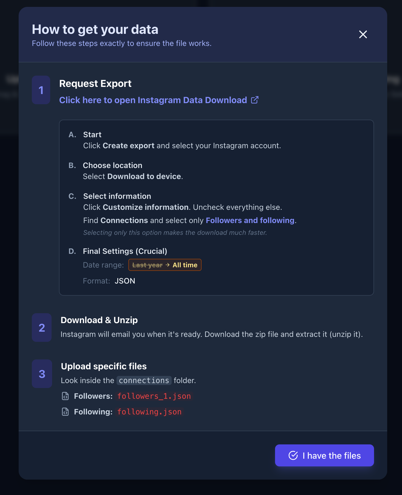
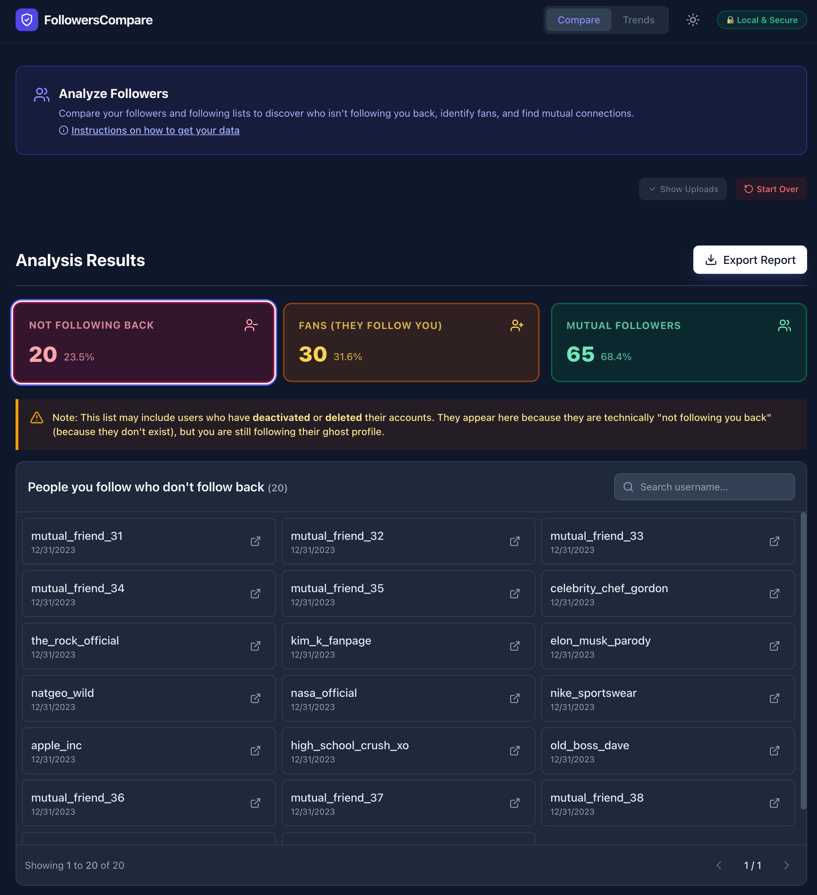
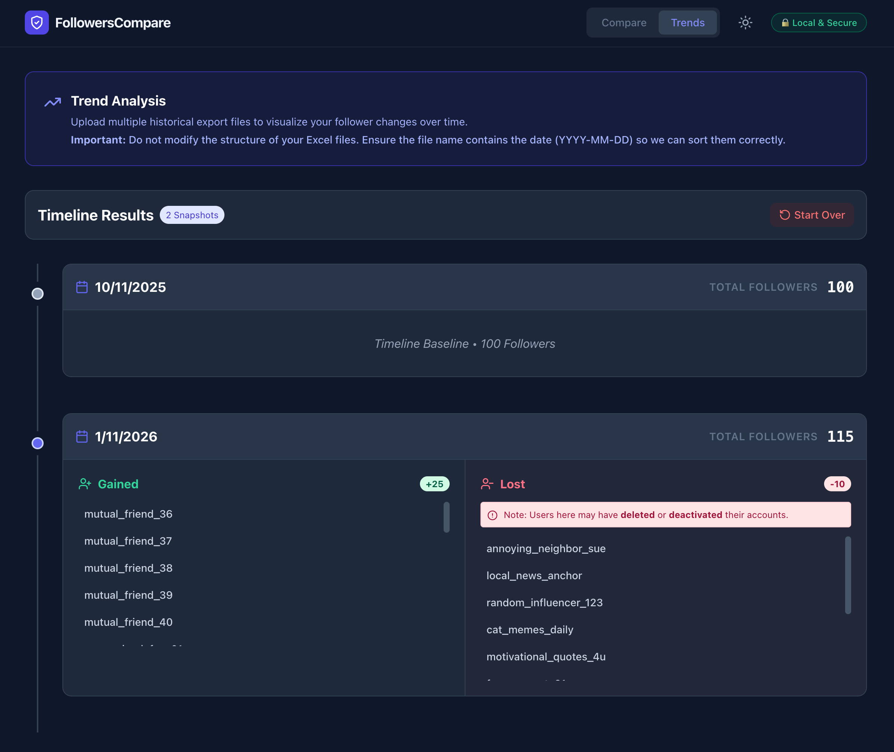

# Followers Compare & Trend Analysis

A local, privacy-focused tool to analyze your Instagram connections. Compare your "Followers" vs "Following" to see who isn't following you back, and track follower trends (gains/losses) over time using historical data.

## Try it yourself: [Live Site](https://followercompare.conway.im/)  

## Features

* **Snapshot Compare:** Upload your current `followers` and `following` files to instantly see:
    * Users you follow who don't follow you back.
    * Fans (people following you who you don't follow).
    * Mutual connections.
* **Trend Analysis:** Upload multiple historical export files (Excel or JSON) to generate a timeline of exactly when you gained or lost specific followers.
* **Privacy First:** All data processing happens **locally in your browser**. No data is ever sent to an external server.
* **File Support:** Supports both new and legacy Instagram export formats (JSON & HTML).

## How to Get Your Data

1. Go to **Instagram Settings** -> **Your Activity** -> **Download your information**.
2. Click **Create export** and select your Instagram account.
3. Select **"Download to device"**.
4. Under **"Select Information"**, click **"Customize information"**.
5. Scroll down to **Connections** and select **only** "Followers and following". (Selecting only this option speeds up the download significantly).
6. **Date Range:** Select **"All time"**.
7. **Format:** JSON (Recommended) or HTML.
8. Once downloaded, unzip the file and look for:
    * `followers_1.json` (or `.html`)
    * `following.json` (or `.html`)

## Screenshots

Click to expand screenshots

#### Instructions
 

#### Not Following Back
  

#### Trends Over Time
  

## Disclaimer

This tool is not affiliated with, endorsed by, or associated with Instagram or Meta Platforms, Inc. It is a utility for processing personal data you have legally downloaded.

**Note:** "Lost Followers" or "Not Following Back" lists may include users who have deactivated or deleted their accounts, as they remain in your history data but cannot be found publicly.

## Author
Check out my other projects at [brian.conway.im](https://brian.conway.im/).
Find this or any of my other projects useful or helpful? [Support my work (Buy me a coffee)](https://buymeacoffee.com/brianconway).

## Acknowledgments
This project was coded with AI assistance, but fully reviewed, tested, and approved by hand. See [AIACKNOWLEDGMENT.md](AIACKNOWLEDGMENT.md) for details.

*This software is provided "as is", without warranty of any kind, express or implied.*